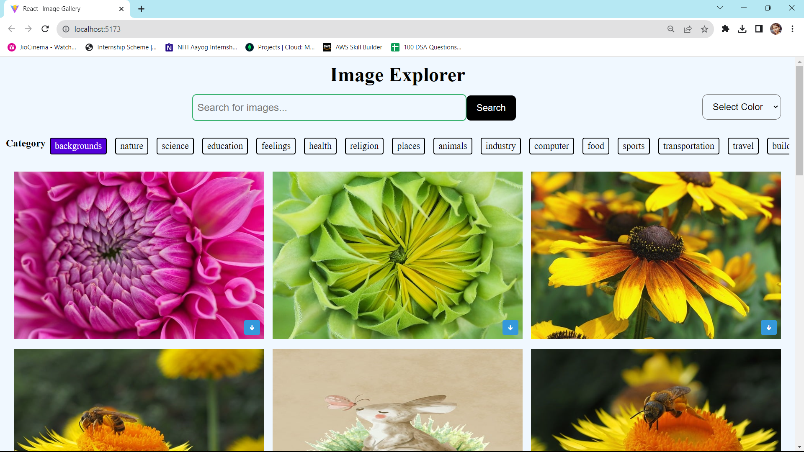
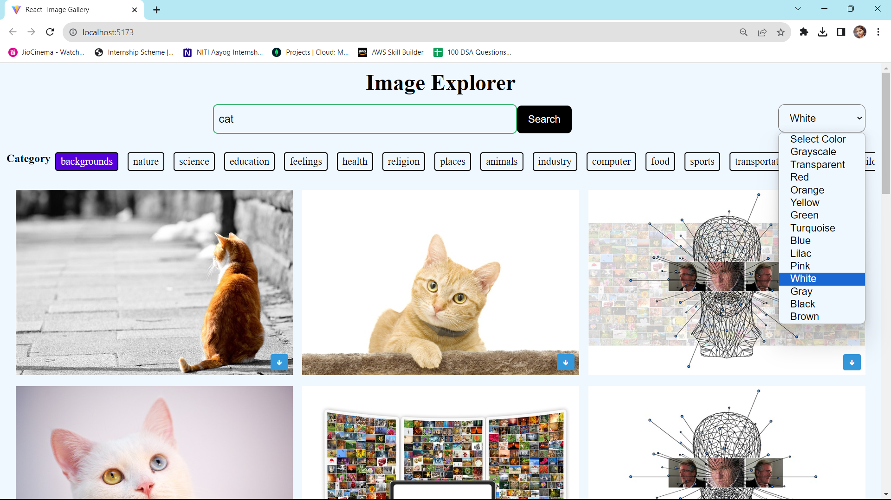

# Image-Explorer

Welcome to the Image Explorer! Immerse yourself in a visually captivating experience where you can explore, search, and filter a diverse collection of images. From stunning landscapes to creative artworks, the Image Explorer offers a dynamic platform to satisfy your visual curiosity.

## Features

- **Explore:** Dive into a vast collection of images spanning various themes and genres.
- **Search:** Utilize the powerful search functionality to find images of your choice.
- **Color Filtering:** Filter images by color properties to create visually appealing combinations.
- **Categories:** Discover images by categories such as 'backgrounds', 'nature', 'science', and more.
- **Responsive:** Enjoy the seamless experience on different devices with responsive design.
- **Built with ReactJS:** Crafted using ReactJS for interactive user interfaces.
- **API Integration:** Utilizes the Pixabay API to fetch images.

## Screenshots

## Getting Started

1. **Clone the Repository:** `git clone https://github.com/kajalpandey25/Image-Explorer.git`

2. **Install Dependencies:** `npm install`

3. 3. **Add your Pixabay API Key:** Open `src/App.js` and replace `'YOUR_API_KEY'` with your Pixabay API key. You can generate an API key by signing up on [Pixabay](https://pixabay.com/api/docs/).

4. **Start Development:** `npm run dev`

5. **Access the Gallery:** Open your browser and visit the provided URL.
